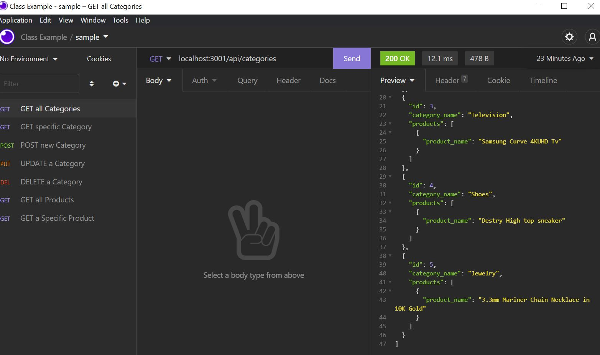

# E_Commerce_Back_End

## Table of Contents

- [Description](#description)
- [Demo](#demo)
- [Screenshots](#screenshots)
- [Usage](#usage)

## Description

The E-Commerce Backend is a REST API for an internet retail website. The API is built onto an `Express.js` server that uses `Sequelize` to interact with a `MySQL` database. Sequelize is a promise-based `Node.js` ORM(Object Relation Mapping) for Postgres, MySQL, MariaDB, SQLite and Microsoft SQL Server.

This E-Commerce backend has the API routes that point to each of the standard CRUD operations for each data group. The routes can be used to:

- Create categories, products, tags
- View categories, products, tags
- Establish associations between the different entities
- Update categories, products, & tags
- Delete entries from the database

The only missing component to make this a complete E-Commerce website is a simple front-end application that would make calls to the API routes that are already built-in.

# Demo

[Play Demonstration](https://watch.screencastify.com/v/yA6zJ31KjFMxOMTYGUZz)

# Screenshot

# Usage

_This section assumes you have installed the application, and created the .env file in the root directory._

---

To finish the set-up the application, complete the following steps:

- Create a MySQL database on your local machine using the schema.sql file located in the /db/ directory(From the MySQL CLI, source db/schema.sql)

- Seed the database with sample data to be used for testing purposes(Run npm run seed from inside the root directory of the project)
  Now you're ready to start the application!

### You can start the server by running:

## **_npm start_**

The server is running, now you can make requests to it through your desired method. For this application I used [Insomnia](https://insomnia.rest/).

# Author

## **_Javis Carr_**

### **Email:** Javis.Carr@gmail.com

### **LinkedIn:** [Click here](https://www.linkedin.com/in/javis-carr-8a584533/)
